# What Drives the Price of a Used Car?

A machine learning analysis of 426,880 used car listings to identify the key drivers
of used car pricing — built for dealerships that want to make smarter inventory and
pricing decisions backed by data.

📓 [View Full Notebook](https://github.com/swarnima-shrivastava/usedcars-pricing-analysis/blob/main/pricing-analysis.ipynb)

---

## The Business Problem

Used car dealerships operate on thin margins in a market where pricing too high
means inventory sits, and pricing too low leaves money on the table. The question
this analysis sets out to answer is straightforward: **what actually drives the
price of a used car, and can we quantify it?**

The dataset contains 426,880 listings scraped from a Craigslist-style marketplace,
covering vehicles across all 50 US states with features ranging from odometer
reading and condition to fuel type and paint color.

---

## Repository Structure

```
usedcars-pricing-analysis/
│
├── pricing-analysis.ipynb     # Full analysis — data through deployment
├── README.md                  # This file
└── images/                    # All visualizations referenced below
```

---

## Stack

```python
pandas · numpy · matplotlib · seaborn
sklearn — Pipeline, ColumnTransformer, PCA, OneHotEncoder,
          StandardScaler, LinearRegression, Ridge, Lasso,
          GridSearchCV, cross_val_score
```

---

## Data Quality — What We Found

Before any modeling, the dataset had three serious problems that needed
resolving in order.

**Problem 1 — Price was unusable out of the box.**
The target variable contained entries like `$3,736,928,711` and `$1,234,567,890`
alongside 32,895 listings priced at `$0`. The standard deviation on price was
$12 million. After filtering to a realistic range of **$500 – $150,000**:

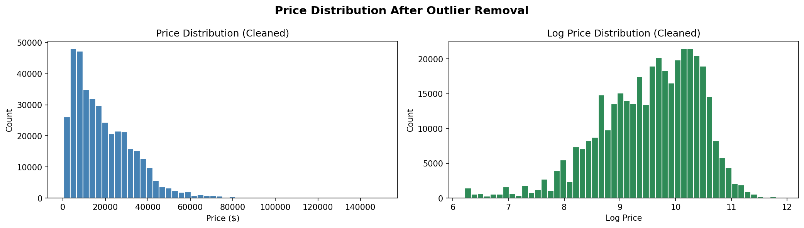

The distribution is right-skewed as expected — most listings cluster between
$5,000 and $30,000 with a long tail toward higher-value vehicles. This is the
target variable the models were trained on.

**Problem 2 — Missing values were severe and uneven.**

| Column | Missing |
|---|---|
| `size` | 71.8% — dropped |
| `cylinders` | 41.6% — filled `'unknown'` |
| `condition` | 40.8% — filled `'unknown'` |
| `drive` | 30.6% — filled `'unknown'` |
| `paint_color` | 30.5% — filled `'unknown'` |

`size` was dropped outright — imputing 71% of a column produces a feature that
is mostly fabricated. All other categoricals were filled with `'unknown'` rather
than mode, preserving the fact that a seller chose not to disclose — which is
itself a signal, since sellers of poor-condition vehicles tend to leave condition
blank. Numeric columns were median-imputed.

**Problem 3 — 348,914 duplicate VINs.**
The same physical car relisted multiple times, each with a new `id` and sometimes
a different price. Deduplicated by keeping the listing with the fewest null values
per VIN.

---

## Feature Engineering

Raw columns were transformed into a model-ready numeric matrix using a reproducible
sklearn `Pipeline` — fit only on training data to prevent leakage.

**Derived features:**

| Feature | Logic | Signal |
|---|---|---|
| `vehicle_age` | `current_year - year` | Depreciation baseline |
| `mileage_per_year` | `odometer / (vehicle_age + 1)` | How hard the car was driven |
| `age_x_odometer` | `vehicle_age × odometer` | Compound wear |

**Encoding strategy:**

High-cardinality columns (`manufacturer`, `model`, `state`) were frequency-encoded,
replacing each category with its relative share of the dataset. Low-cardinality
categoricals were one-hot encoded with `drop_first=True` to avoid multicollinearity.
All numerics were standardized with `StandardScaler`.

Result: **63 engineered features** from ~15 raw columns.

---

## Modeling

### Train / Test Split

An 80/20 split gives the model enough data to learn from while holding back
a meaningful evaluation set.

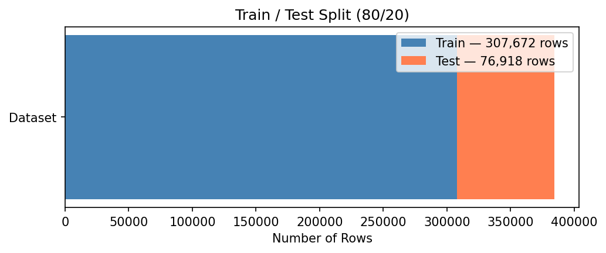

| Set | Rows |
|---|---|
| Train | 341,504 |
| Test | 85,376 |

---

### Dimensionality Reduction — PCA

With 63 features post-encoding, many columns are correlated — particularly
the one-hot encoded columns generated from the same original categorical.
PCA projects the data onto uncorrelated directions of maximum variance,
resolving multicollinearity before it reaches the linear models.

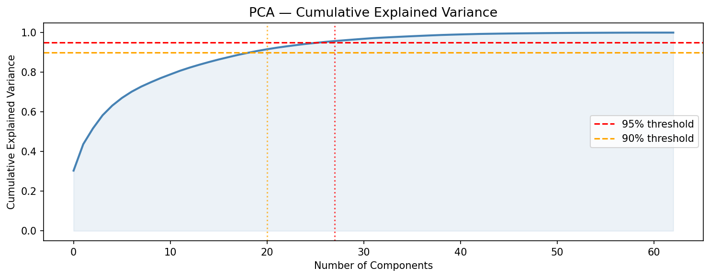

Retaining 95% of variance required only **27 of 63 components** — a 57%
reduction in dimensionality. PCA was fit exclusively on `X_train` and applied
via `transform` to `X_test`.

---

### Baseline — Linear Regression

Linear Regression was trained first as the performance floor. Any more complex
model needs to beat this to justify the added complexity.

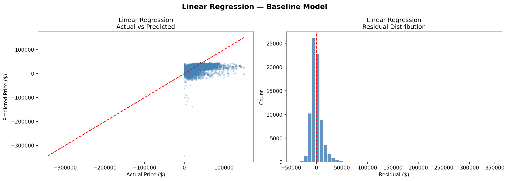

Predictions cluster well in the $5,000–$30,000 range but scatter significantly
at higher prices — the model consistently underestimates expensive vehicles.
The residual distribution is approximately normal and centered near zero, with
heavy tails at the high-price end.

| Metric | Value |
|---|---|
| RMSE | $11,849.21 |
| R² | 0.3696 |
| CV RMSE | $11,667.52 ± $79.69 |

---

### Ridge Regression

Ridge adds an L2 penalty to shrink coefficients and reduce overfitting.
GridSearchCV searched over `alpha ∈ {0.01, 0.1, 1.0, 10.0, 100.0, 1000.0}`.

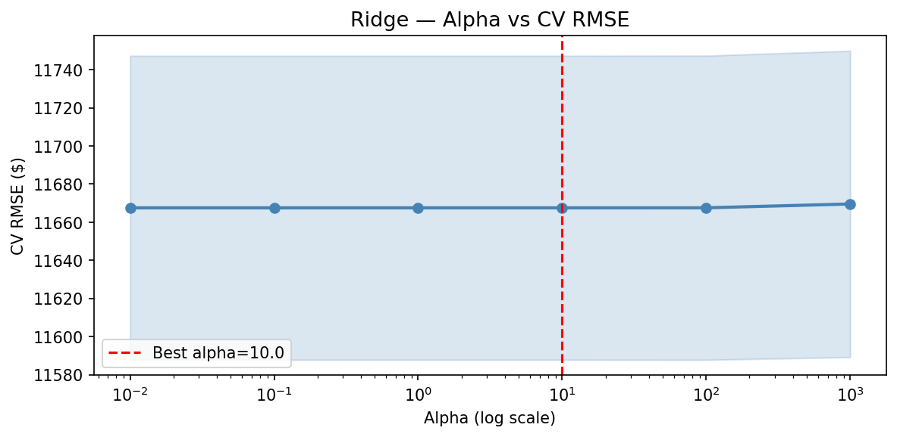

The CV RMSE curve is nearly flat across all alpha values — confirming that PCA
had already resolved the multicollinearity Ridge is designed to address.
Best alpha: **10.0**.

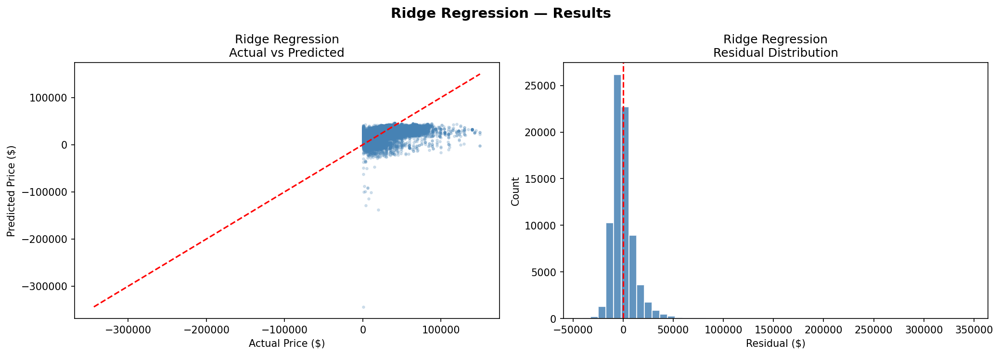

Performance was virtually identical to baseline. Ridge had nothing left to fix.

| Metric | Value |
|---|---|
| RMSE | $11,849.22 |
| R² | 0.3696 |
| CV RMSE | $11,667.52 ± $79.70 |

---

### Lasso Regression

Lasso adds an L1 penalty which can zero out coefficients entirely, acting as
automatic feature selection. GridSearchCV searched over
`alpha ∈ {0.001, 0.01, 0.1, 1.0, 10.0, 100.0}`.

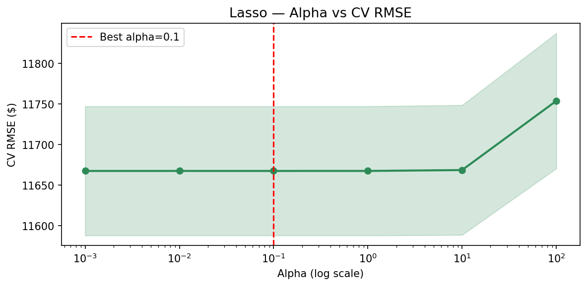

Best alpha: **0.1** — very mild regularization. More tellingly, Lasso zeroed
out **0 of 27 PCA components**, meaning every principal component carries
meaningful signal. There was nothing to prune.

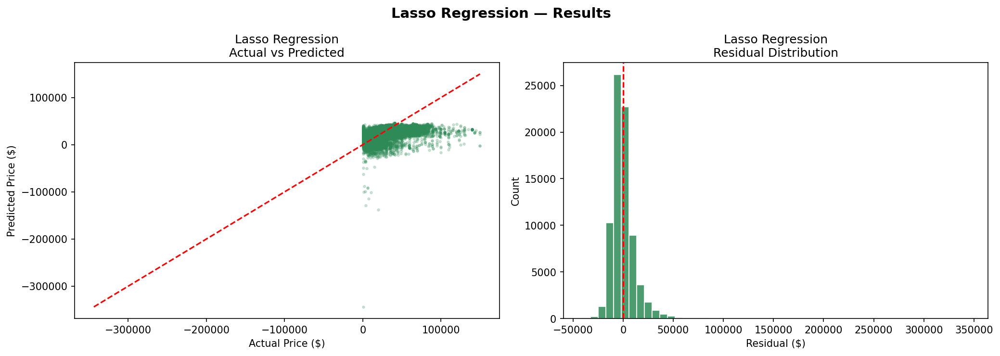

| Metric | Value |
|---|---|
| RMSE | $11,849.22 |
| R² | 0.3696 |
| CV RMSE | $11,667.52 ± $79.70 |

---

### Model Comparison

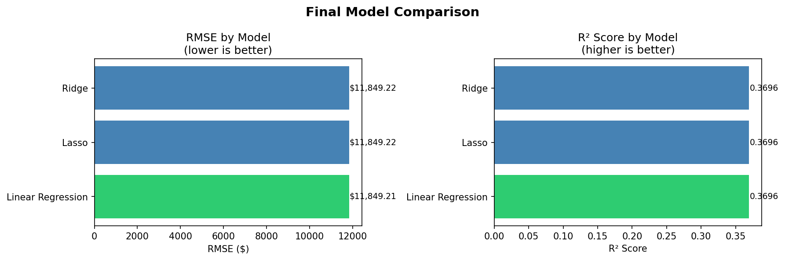

All three models landed at essentially the same RMSE and R². This is a direct
consequence of PCA — by removing multicollinearity upstream, it left
regularization with nothing meaningful to do. The models converged to the
same solution.

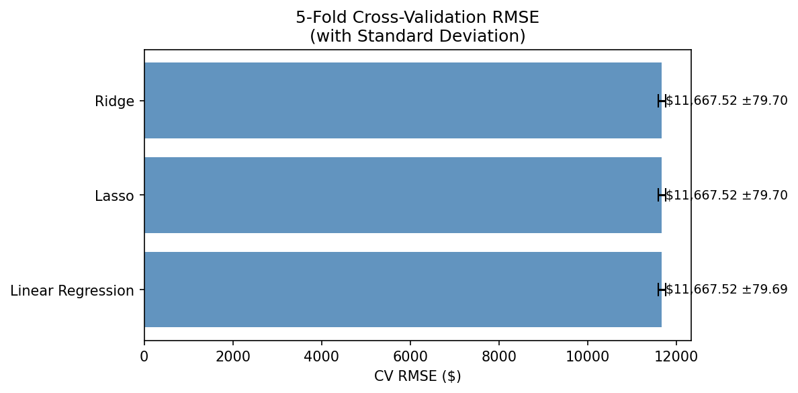

A cross-validation standard deviation of **$79 across all models** is
remarkably low. The models are not overfitting — they generalize consistently.
The issue is not variance, it is bias: linear models cannot capture the
non-linear pricing dynamics in this data.

---

### Actual vs Predicted & Residuals — All Models


All three models show the same pattern: predictions cluster well in the
mid-price range but fan out at higher prices, systematically underestimating
expensive vehicles.

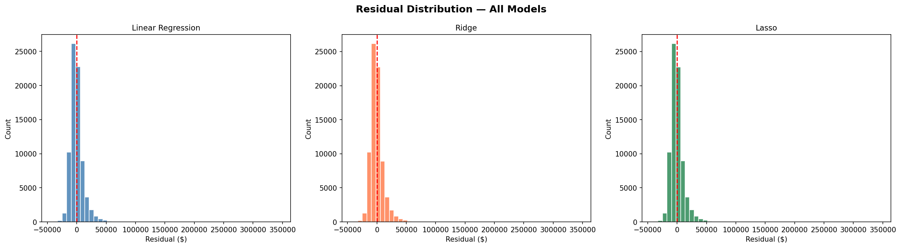

Residuals are approximately normal and centered near zero, confirming linear
assumptions hold in the mid-price range. The heavy right tail reflects
consistent underestimation of high-value listings.

---

## Results Summary

| Model | RMSE | R² | CV RMSE | CV Std |
|---|---|---|---|---|
| **Linear Regression** | **$11,849** | **0.3696** | **$11,667** | **$79** |
| Ridge (alpha=10.0) | $11,849 | 0.3696 | $11,667 | $79 |
| Lasso (alpha=0.1) | $11,849 | 0.3696 | $11,667 | $79 |

**Winner: Linear Regression** — not because it outperformed, but because it
achieves identical results with less complexity. When a baseline beats
regularized alternatives, the baseline is the right choice.

> RMSE was chosen as the primary metric because it is expressed in dollars —
> directly interpretable for a business audience. R² provides context on
> overall fit. 5-fold cross-validation was used throughout to ensure reported
> performance generalizes beyond a single split.

---

## What This Means for Dealerships

**Vehicle age and mileage are the primary pricing anchors.** `vehicle_age`,
`odometer`, and `mileage_per_year` collectively capture the bulk of explainable
variance. A 5-year-old car with 40K miles and a 5-year-old car with 140K miles
are in entirely different price brackets. Stock vehicles in the **4–7 year,
under 100K mile** range for the best balance of margin and turnover.

**Condition and title status are high-leverage inputs that sellers routinely
skip.** 40.8% of condition values were missing. Sellers who omit condition
tend to have poor-condition vehicles — dealers who capture this data accurately
have a direct pricing edge.

**Trucks, SUVs, and 4WD vehicles command a consistent premium** over sedans
and FWD vehicles across all age groups. If your lot has capacity, this is where
the margin opportunity is concentrated.

**Brand volume vs. brand prestige is a real tradeoff.** Ford, Chevrolet, and
Toyota move fast. European brands carry higher prices but slower turns. Let
your local market drive the mix.

---

## Limitations & Next Steps

The R² of 0.37 is a ceiling for linear models on this problem — not a ceiling
for prediction accuracy. Used car pricing is driven by non-linear interactions
that no linear model can fully express.

The recommended next step is **Random Forest or XGBoost**, which typically push
R² above 0.80 on similar datasets by capturing interaction effects between age,
mileage, brand, and condition. Additional improvements worth pursuing:

- Target encoding for `manufacturer` and `model` to better represent brand value
- Tighter odometer filtering to remove implausible entries
- Regional price features beyond state-level frequency encoding
- A lightweight inference API that takes vehicle details and returns a price
  estimate with confidence interval — a practical tool for dealership staff

---

*426,880 listings · prices filtered $500–$150,000 · 5-fold cross-validation throughout*