# What Drives the Price of a Used Car?

A machine learning analysis of 426,880 used car listings to identify the key drivers of used car pricing, built for dealerships that want to make smarter inventory and pricing decisions backed by data. This also helps them move their inventory faster with a basic assumption that they operate on thin margins in a market where pricing too high means inventory sits and pricing too low leaves money on the table.

[View Full Notebook](https://github.com/swarnima-shrivastava/usedcars-pricing-analysis/blob/main/pricing-analysis.ipynb)

## 1. Business Understanding

The question I aim to answer through this analysis is: **what actually drives the price of a used car and can we help dealerships fine-tune their inventory and pricing strategies using past data to provide data-backed recommendations?**

## 2. Data Understanding & Quality Control

I analyzed the the dataset and found three problems that needed attention before we could use that for modeling.

### Problem 1: Price was unusable out of the box

The target variable contained entries like `$3,736,928,711` and `$1,234,567,890` and `$0`. The standard deviation on price was $12 million. I filtered the pricing to contain entries in a realistic range of **$500 – $150,000**
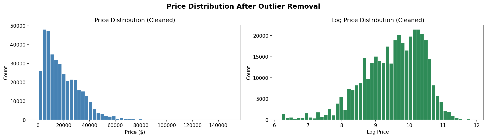

Post filtering, most listings cluster between $5,000 and $30,000 with a long tail toward higher-value vehicles. This is the target variable I use later to train the models.

### Problem 2: Missing values were severe and uneven

| Column | Missing |
|---|---|
| `size` | 71.8% — dropped |
| `cylinders` | 41.6% — filled `'unknown'` |
| `condition` | 40.8% — filled `'unknown'` |
| `drive` | 30.6% — filled `'unknown'` |
| `paint_color` | 30.5% — filled `'unknown'` |

- `size` was dropped outright imputing 71% of a column produces a feature that is mostly fabricated. 
- All other categorical values were filled with `'unknown'`
- Numeric columns were median-imputed

### Problem 3: 348,914 duplicate VINs
Duplicate entries of car with same VIN that was relisted multiple time with a new `id` and sometimes a different price. Deduplicated by keeping the listing with the fewest null values per VIN.

## Feature Engineering & Dimensionality Reduction

The analysis utilized a reproducible scikit-learn Pipeline with an 80/20 train-test split.
Derived Features: Created new metrics like `vehicle_age` and `mileage_per_year` to better capture depreciation.

| Feature | Logic | Signal |
|---|---|---|
| `vehicle_age` | `current_year - year` | Depreciation baseline |
| `mileage_per_year` | `odometer / (vehicle_age + 1)` | How hard the car was driven |
| `age_x_odometer` | `vehicle_age × odometer` | Compound wear |

High-cardinality columns (`manufacturer`, `model`, `state`) were frequency-encoded, replacing each category with its relative share of the dataset. Low-cardinality categoricals were one-hot encoded. All numerics were standardized with `StandardScaler`.

Also applied PCA (Principal Component Analysis) to resolve multicollinearity, reducing 63 engineered features down to 27 components while retaining 95% of the variance.
With 63 features post-encoding, many columns are correlated particularly the one-hot encoded columns generated from the same original categorical. PCA projects the data onto uncorrelated directions of maximum variance,
resolving multicollinearity before it reaches the linear models. PCA was fit exclusively on `X_train` and applied via `transform` to `X_test`.

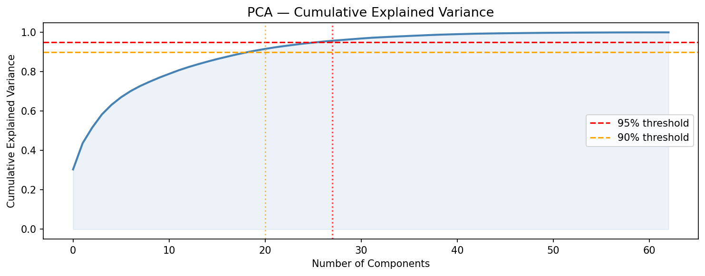


Finally, raw columns were transformed into a model-ready numeric matrix using a reproducible sklearn `Pipeline` that was fit only on training data to prevent leakage.

## Modeling

### Train / Test Split

I compared three models using 5-fold cross-validation to ensure the results generalize to new data. An 80/20 split gives the model enough data to learn from and conduct a meaningful evaluation.

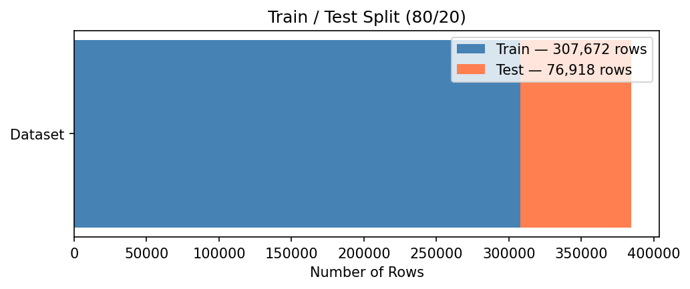

| Set | Rows |
|---|---|
| Train | 341,504 |
| Test | 85,376 |

Note: RMSE (Root Mean Squared Error) is chosen as the primary metric because it is expressed in dollars, making it directly interpretable for business stakeholders.

### 1. Linear Regression (Served as the performance baseline)

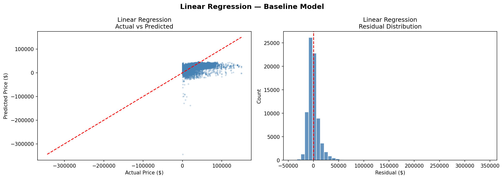

Findings: Predictions cluster well in the $5,000–$30,000 range but scatter significantly at higher prices, the model consistently underestimates expensive vehicles.
The residual distribution is approximately normal and centered near zero, with heavy tails at the high-price end.

| Metric | Value |
|---|---|
| RMSE | $11,849.21 |
| R² | 0.3696 |

### 2. Ridge Regression

Here, I utilized GridSearchCV (alpha range: 0.01 to 1000) to penalize large coefficients and reduce overfitting. GridSearchCV searched over `alpha ∈ {0.01, 0.1, 1.0, 10.0, 100.0, 1000.0}`.

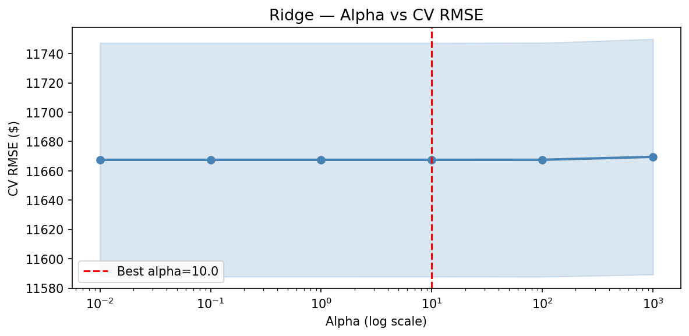

The CV RMSE curve is nearly flat across all alpha values confirming that PCA had already resolved the multicollinearity Ridge is designed to address.
Best alpha: **10.0**.

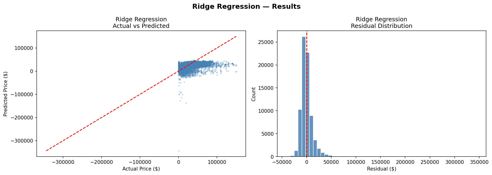

Performance was virtually identical to baseline. Ridge had nothing left to fix.

| Metric | Value |
|---|---|
| RMSE | $11,849.22 |
| R² | 0.3696 |

### Lasso Regression

Lastly in Lasso, I utilized GridSearchCV (alpha range: 0.001 to 100) for automatic feature selection. GridSearchCV searched over
`alpha ∈ {0.001, 0.01, 0.1, 1.0, 10.0, 100.0}`.

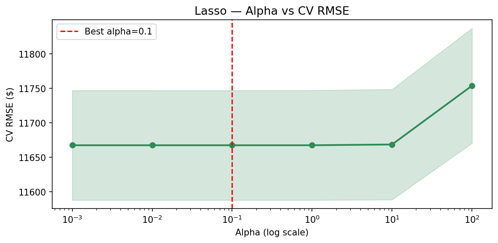

Best alpha: **0.1** is very mild regularization. More tellingly, Lasso zeroed out **0 of 27 PCA components**, meaning every principal component carries meaningful signal.

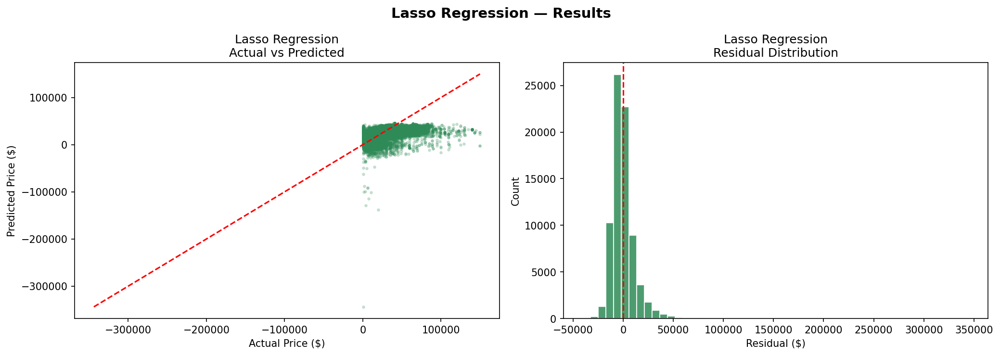

| Metric | Value |
|---|---|
| RMSE | $11,849.22 |
| R² | 0.3696 |

### Model Comparison

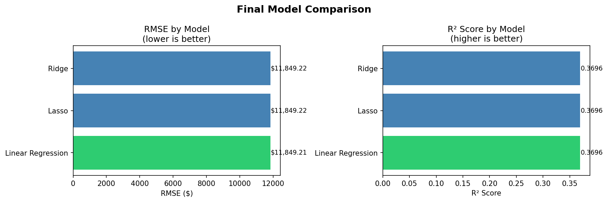

All models converged to the same result because PCA had already handled the multicollinearity that Ridge and Lasso are designed to address. Linear Regression should be selected for its simplicity.

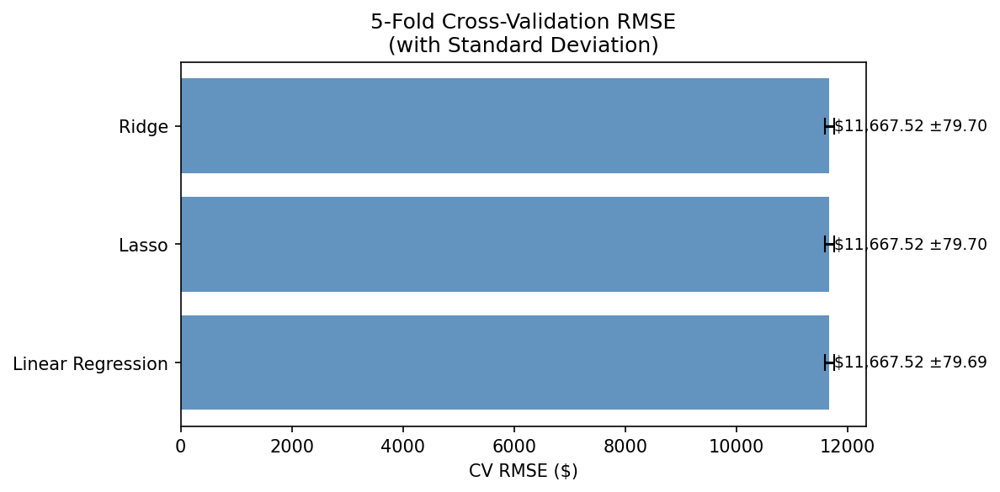


### Actual vs Predicted & Residuals — All Models

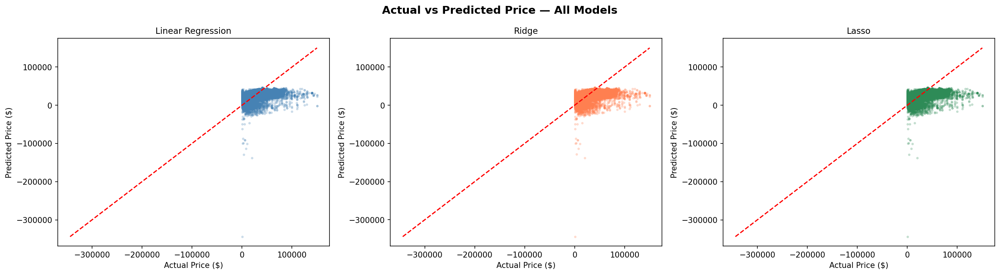

All three models show the same pattern: predictions cluster well in the mid-price range but fan out at higher prices, systematically underestimating expensive vehicles.

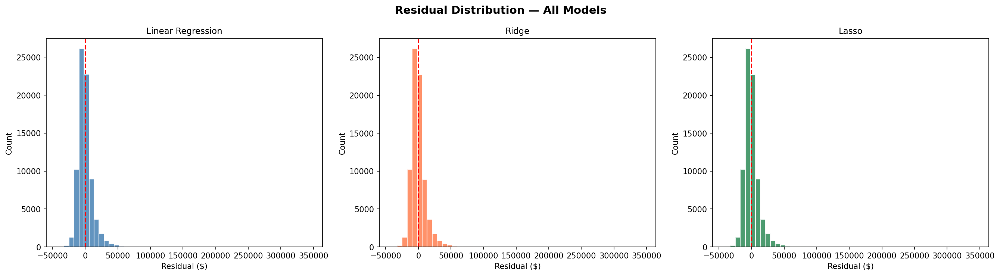

Residuals are approximately normal and centered near zero, confirming linear assumptions hold in the mid-price range. The heavy right tail reflects consistent underestimation of high-value listings.


## Results Summary

| Model | RMSE | R² | CV RMSE | CV Std |
|---|---|---|---|---|
| **Linear Regression** | **$11,849** | **0.3696** | **$11,667** | **$79** |
| Ridge (alpha=10.0) | $11,849 | 0.3696 | $11,667 | $79 |
| Lasso (alpha=0.1) | $11,849 | 0.3696 | $11,667 | $79 |

**Winner: Linear Regression** not because it outperformed, but because it achieves identical results with less complexity. When a baseline beats regularized alternatives, the baseline is the right choice.

Note: RMSE was chosen as the primary metric because it is expressed in dollars and is more understandable by the business audience whereas we use R² to provide context on overall fit. 

## What This Means for Dealerships

1. Vehicle age and mileage are the primary pricing anchors. `vehicle_age`, `odometer` and `mileage_per_year` are the most critical features. A 5-year-old car with 40K miles and a 5-year-old car with 140K miles
are in entirely different price ranges. Dealerships should stock vehicles that are in the 4–7 year and under 100K mile range for best profit margins.

2. Condition and title status are high-leverage inputs that sellers routinely skip. 40.8% of condition values were missing. Sellers who omit condition tend to have poor-condition vehicles and the ones who capture this data accurately have a direct pricing edge.

3. Trucks, SUVs and 4WD vehicles command a consistent premium over sedans and FWD vehicles across all age groups. If dealership lot has capacity, they should leverage this opportunity to concentrate on the margins.

4. Brand volume vs. brand prestige is a real tradeoff. Ford, Chevrolet and Toyota are sold faster. European brands carry higher prices but slower turns. Delaerships should decide the proportion of their stock driven by local market though.

## Stack

```
python - pandas, numpy, matplotlib, seaborn
sklearn - Pipeline, ColumnTransformer, PCA, OneHotEncoder,
          StandardScaler, LinearRegression, Ridge, Lasso,
          GridSearchCV, cross_val_score
```

## Limitations & Next Steps

The R² of 0.37 is a ceiling for linear models on this problem. Used car pricing is driven by non-linear interactions that no linear model can fully express.
However, the current linear models struggle to capture the non-linear dynamics of high-end, luxury vehicles. Future iterations of this project should:
1. Implement `Random Forest` or `XGBoost` models to capture complex interactions between brand, condition, and mileage
2. Develop a lightweight inference API for dealership staff to input vehicle details and receive instant price estimates
